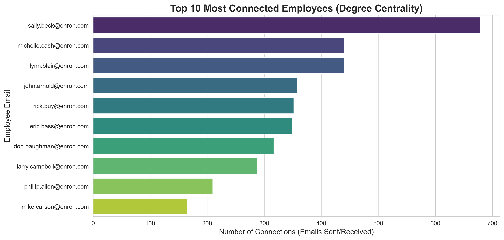

## Enron Network Analysis & Link Prediction
## Overview
This project performs an in-depth Social Network Analysis (SNA) on the Enron Email Dataset. By transforming over 47,000 email records into a multidimensional graph, we uncover the hidden organizational power dynamics, identify key influencers, and predict future communication links using machine learning principles.

## Dataset Source
The analysis is based on the Enron Email Dataset. Due to the large file size (>1GB), the raw `emails.csv` file is not included in this repository. You can download the dataset from Kaggle:
* **[Enron Dataset Source (Kaggle)](https://www.kaggle.com/code/jamestollefson/enron-network-analysis/input)**

## Key Features
Scalable Graph Construction: Developed a network with 8,936 nodes and 10,035 edges using NetworkX.

### 1. Influence Metrics: Ranked key employees using three core centrality measures:

1. PageRank: To find the most "prestigious" figures.

2. Betweenness: To identify the "gatekeepers" of information.

3. Degree: To measure raw connectivity and activity.

### 2. Link Prediction: Implemented the Jaccard Coefficient algorithm to predict potential future collaborations between employees who haven't interacted yet.

### 3. Automated Visualization: High-resolution export of network maps and statistical distributions.

## Tech Stack
Language: Python 3.x

- Core Libraries: * NetworkX: Graph theory and network algorithms.

- Pandas: Data manipulation and cleaning.

- Matplotlib & Seaborn: Professional data visualization.

- Community-Louvain: For community detection and clustering.

## Key Insights
- The Power Hubs: Identified individuals like Sally Beck as central hubs with the highest PageRank and Degree.

- Information Gatekeepers: Found critical "bridges" (high Betweenness) whose absence would lead to communication breakdown between departments.

- Predictive Success: Successfully identified pairs of employees with a >50% probability of needing future collaboration based on mutual neighbors.

## Visualizations Produced
### 1. The Communication Network
This graph represents Enron's email exchanges.

### 2. Top 10 Influencers
A focused look at the most connected individuals within the organization.

---

## Key Findings
* **Predictive Success:** Successfully identified pairs of employees with a >50% probability of needing future collaboration based on mutual neighbors.
